 

  

### <code>rafiq@github ~ $ ./contributions.sh</code>

### <code>rafiq@github ~ $ whoami</code>

<table>
<tr>
<td width="50%" valign="top"></td>
<td width="50%" valign="top"></td>
</tr>
</table>

**I build AI tools, full-stack products, and software for design and business workflows.**

My work connects Python and React applications, ERP integrations, document intelligence, and computational design. I also explore local AI and native macOS productivity tools.

### <code>rafiq@github ~ $ ls featured/</code>

| Project | What I'm building | Stack / focus |
| :--- | :--- | :--- |
| [**Inai · இணை**](https://github.com/mr-rafiq/inai) | A local-first personal AI with graph memory. The text-based foundation is complete; voice and generative UI are on the roadmap. | TypeScript · React · Python · local AI |
| [**TextSnipper**](https://github.com/mr-rafiq/textsnipper) | A native macOS menu bar app for offline OCR, QR capture, and clipboard history. | Swift · SwiftUI · Apple Vision |
| [**Machine Learning Roadmap**](https://github.com/mr-rafiq/Machine_Learning_RoadMap) | My roadmap for learning machine learning. | Python · Jupyter · ML |
| [**NLP Projects**](https://github.com/mr-rafiq/NLP-Projects) | NLP projects developed along my learning path. | Natural language processing |

### <code>rafiq@github ~ $ cat stack.txt</code>

| Area | Tools I work with |
| :--- | :--- |
| **Frontend** | React · Next.js · JavaScript · TypeScript · Tailwind CSS · AG Grid |
| **Backend & desktop** | Python · FastAPI · Flask · Django · C# · WPF · Swift |
| **Data & cloud** | SQL Server · SQLAlchemy · Dapper · MongoDB · AWS · Azure |
| **AI & computer vision** | OpenAI API · RAG · PyTorch · TensorFlow · OpenCV · YOLO |
| **Delivery** | Docker · Git · Jenkins · NGINX |

### <code>rafiq@github ~ $ cat experience.md</code>

**Software development at Hoelscher GmbH · Kleve, Germany**

Professional work across ERP integration, project management, IT asset management, and architectural drawing analysis, including leading small teams and mentoring developers.

<b>Explore my professional projects and background</b>

 

| Project | Work & impact | Technology |
| :--- | :--- | :--- |
| **Kalkverse** | Facade project management with automated cost, budget, and timeline calculations from tender documents. Reduced ERP project creation from **4 days to 6 hours**. | FastAPI · React · Tailwind CSS · SQLAlchemy · AG Grid |
| **HIT** | Led a two-person team from MVP to an operational IT asset management application in **one month**. | React · Flask · SQL Server · SQLAlchemy |
| **Manageverse** | Led a three-person team building a Windows application to enhance ERPlus project timelines and cost calculations. | C# · WPF · Dapper · SQL Server |
| **AI Plugin for Rhino** | Built a part-identification MVP in two months with Ostbayerische Technische Hochschule Regensburg, applying computer vision to architectural drawings. | Python · C# · YOLO v5 |

Additional work includes **RAG document-reading tools using the OpenAI API**, cross-functional collaboration, and developer mentoring.

**Education**

- **Master's in Computational Design (M.E.)** · Technische Hochschule Ostwestfalen-Lippe, Germany · 2018–2021
- **Bachelor of Architecture** · B. S. Abdur Rahman University, India · 2012–2017

### <code>rafiq@github ~ $ cat next.txt</code>

Local-first AI · AI/ML in web applications · Microservices · Real-time ERP data · Cloud-native development

### <code>rafiq@github ~ $ ./connect.sh</code>

[Portfolio](https://www.rafiq.tech) &nbsp; / &nbsp; [LinkedIn](https://www.linkedin.com/in/rafiqmohamd) &nbsp; / &nbsp; [Email](mailto:mohamed-rafiq@outlook.com) &nbsp; / &nbsp; [X · @ar7rafiq](https://twitter.com/ar7rafiq) &nbsp; / &nbsp; [Instagram · @rafiq.explores](https://instagram.com/rafiq.explores)

 

“Technology is the answer but what was the question” — Cedric Price

